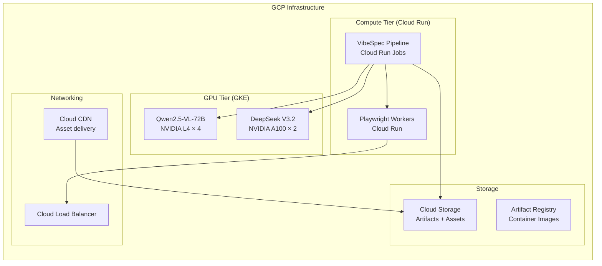

# VibeSpec — GCP Deployment Cost Model & Open-Source Integration

> Cost estimates for running the full VibeSpec pipeline on Google Cloud Platform.
> All prices are **monthly estimates** based on GCP us-central1 pricing as of March 2026.

---

## Architecture Overview



---

## Cost Breakdown by Component

### 1. GPU Compute — Model Serving (GKE)

The most expensive component. Required for running the open-weight VLM and reasoning models.

| Component | GCP Service | Machine Type | GPUs | $/hr | Hours/mo | Monthly Cost |
|-----------|-------------|--------------|------|------|----------|-------------|
| **Qwen2.5-VL-72B** (Phase 1 VLM) | GKE Autopilot | g2-standard-96 | 4× NVIDIA L4 | $7.35 | 160 | **$1,176** |
| **DeepSeek V3.2** (Self-Healing) | GKE Autopilot | a2-highgpu-2g | 2× NVIDIA A100 40GB | $14.68 | 80 | **$1,174** |
| **UI-TARS** (fallback agent) | GKE Autopilot | g2-standard-48 | 2× NVIDIA L4 | $3.68 | 40 | **$147** |

> [!TIP]
> **Cost Optimization:** Use GKE Spot VMs for model serving (60-91% discount). Qwen VL drops to ~$300/mo on Spot. Use preemptible instances during development.

**GPU Subtotal: $2,497/mo** (full price) → **~$750/mo** (with Spot VMs)

---

### 2. CPU Compute — Pipeline & RL Agent (Cloud Run)

| Component | GCP Service | vCPUs | Memory | Requests/mo | Monthly Cost |
|-----------|-------------|-------|--------|-------------|-------------|
| **Pipeline Orchestrator** | Cloud Run Jobs | 4 | 8 GiB | ~500 runs | **$45** |
| **Playwright RL Workers** | Cloud Run | 2 | 4 GiB | ~10K episodes | **$85** |
| **Asset Optimizer** (sharp/svgo) | Cloud Run Jobs | 2 | 4 GiB | ~500 runs | **$25** |
| **Z3 Solver** | Cloud Run Jobs | 4 | 8 GiB | ~500 runs | **$40** |

**CPU Subtotal: ~$195/mo**

---

### 3. Storage — Artifacts, Assets, Container Images

| Component | GCP Service | Volume | Monthly Cost |
|-----------|-------------|--------|-------------|
| **Mockup Storage** | Cloud Storage (Standard) | 50 GB | **$1.15** |
| **Generated Assets** (WebP, SVG) | Cloud Storage (Standard) | 100 GB | **$2.30** |
| **Pipeline Artifacts** (manifests, proofs, TLA+) | Cloud Storage (Standard) | 10 GB | **$0.23** |
| **Container Images** | Artifact Registry | 20 GB | **$2.00** |
| **Model Weights** (cached) | Cloud Storage (Nearline) | 300 GB | **$3.00** |

**Storage Subtotal: ~$9/mo**

---

### 4. Networking & CDN

| Component | GCP Service | Monthly Cost |
|-----------|-------------|-------------|
| **Cloud Load Balancer** | GLB | **$18** |
| **Cloud CDN** (asset delivery) | CDN | **$8** |
| **Egress** (preview deployments) | Standard Tier | **$12** |

**Networking Subtotal: ~$38/mo**

---

### 5. CI/CD & DevOps

| Component | GCP Service | Monthly Cost |
|-----------|-------------|-------------|
| **Cloud Build** (CI pipeline) | Cloud Build | **$10** |
| **Secret Manager** (API keys) | Secret Manager | **$0.36** |
| **Cloud Logging** | Operations Suite | **$5** |

**DevOps Subtotal: ~$15/mo**

---

## Total Monthly Cost Summary

| Tier | Description | Monthly Cost |
|------|-------------|-------------|
| 🟥 **Full Production** | All GPU models on-demand | **$2,754/mo** |
| 🟨 **Optimized Production** | Spot VMs + auto-scaling | **$1,007/mo** |
| 🟩 **Development** | Spot VMs + low traffic | **$450/mo** |
| 🟦 **CI-Only** (no GPU) | Simulation mode, no models | **$65/mo** |

> [!IMPORTANT]
> The **CI-Only** tier uses simulation mode (no real VLM/DeepSeek calls) and is sufficient for development and testing. All pipeline tests pass in simulation mode.

---

## Cost Per Pipeline Run

| Mode | Duration | Cost/Run |
|------|----------|----------|
| **Full Pipeline** (10 screens, GPU) | ~12 min | **$3.50** |
| **Full Pipeline** (10 screens, Spot GPU) | ~12 min | **$1.20** |
| **Ingest Only** (Phase 1, GPU) | ~3 min | **$0.85** |
| **Validate Only** (Phase 5, RL + Z3) | ~5 min | **$0.45** |
| **CI Pipeline** (simulation, no GPU) | ~2 min | **$0.02** |

---

## Open-Source Dependency Map

| Phase | Component | Open-Source Tool | License | Self-Hosted? | GCP Alternative |
|-------|-----------|-----------------|---------|-------------|-----------------|
| 1 | Visual Perception | **Qwen2.5-VL-72B** | Apache-2.0 | ✅ GKE | Vertex AI Gemini |
| 1 | OCR | **Tesseract.js** | Apache-2.0 | ✅ Cloud Run | Cloud Vision API ($1.50/1K) |
| 2 | State Machines | **XState v5** | MIT | ✅ In-process | — |
| 2 | TLA+ Model Check | **Apalache** | Apache-2.0 | ✅ Cloud Run | — |
| 3 | Image Processing | **sharp** | Apache-2.0 | ✅ In-process | — |
| 3 | SVG Optimization | **svgo** | MIT | ✅ In-process | — |
| 4 | Code Generation | **DeepSeek V3.2** | DeepSeek License | ✅ GKE | Vertex AI Codey |
| 5 | Browser Automation | **Playwright** | Apache-2.0 | ✅ Cloud Run | — |
| 5 | Accessibility | **axe-core** | MPL-2.0 | ✅ In-process | — |
| 5 | Spatial Proofs | **Z3 Theorem Prover** | MIT | ✅ Cloud Run | — |
| 5 | Neuro-Symbolic | **Scallop** | Apache-2.0 | ✅ Cloud Run | — |
| 5 | RL Training | **Stable-Baselines3** | MIT | ✅ GKE | Vertex AI Training |
| 5 | RL Scale | **Ray RLlib** | Apache-2.0 | ✅ GKE | — |
| 5 | API Fuzzing | **EvoMaster** | LGPL-3.0 | ✅ Cloud Run | — |

### Fine-Tuning Datasets (Free/Open)

| Dataset | Source | Use Case | Size |
|---------|--------|----------|------|
| **WebSight** | HuggingFace M4 | Layout-to-code VLM fine-tuning | 2M+ pairs |
| **Mind2Web** | OSU NLP | RL behavioral cloning base policy | 2.3K tasks |
| **VisualWebArena** | CMU | Multi-step web interaction training | 910 tasks |
| **Design2Code** | Stanford | Mockup → code benchmark | 484 pages |
| **Screen2Words** | Google Research | Accessibility label verification | 112K screens |

---

## GCP Deployment Architecture

### Option A: Serverless (Cloud Run + GKE Autopilot)

```
Recommended for teams running < 1000 pipeline runs/month
```

- **Pipeline**: Cloud Run Jobs (auto-scales to zero)
- **Models**: GKE Autopilot with Spot GPU pods (auto-scales)
- **Storage**: Cloud Storage Standard
- **CI/CD**: Cloud Build + GitHub Actions

### Option B: Reserved (GKE Standard)

```
Recommended for teams running > 1000 runs/month
```

- **Pipeline**: GKE Standard cluster with dedicated node pool
- **Models**: GKE Standard with reserved A100/L4 GPUs (1-3 year CUDs: 57% discount)
- **Storage**: Cloud Storage with lifecycle policies
- **CI/CD**: Cloud Build + Artifact Registry

### Option C: Hybrid (Cloud Run + Vertex AI)

```
Recommended when data sovereignty requires no self-hosted models
```

- **Pipeline**: Cloud Run
- **VLM**: Vertex AI Gemini 2.0 Flash ($0.075/1M tokens input)
- **Code Gen**: Vertex AI Codey / Gemini
- **Storage**: Cloud Storage
- **Cost**: ~$500/mo (lower ops, higher per-call)

---

## Cost Optimization Strategies

1. **Spot VMs for GPU**: 60-91% discount for interruptible model serving
2. **Auto-scaling to zero**: Cloud Run Jobs shut down between pipeline runs
3. **Model quantization**: GPTQ/AWQ 4-bit quantization → run Qwen VL on 2× L4 instead of 4×
4. **Cached inference**: Hash-based dedup prevents re-processing identical screens
5. **Tiered storage**: Move old artifacts to Nearline/Coldline after 30 days
6. **CUDs (Committed Use)**: 1-year commitment = 37% discount, 3-year = 57% discount
7. **Simulation mode for CI**: Tests pass without GPU — use $65/mo CI-only tier for development
